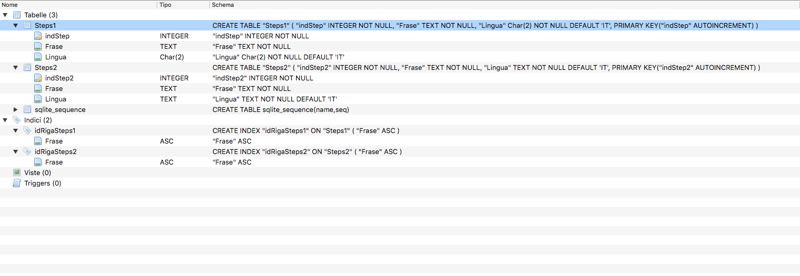

# SfidaScrittura

## Rivisitazione del programma *Write Challeng* (app id: *1051409192*).
***

Questa versione, rispetto alla originale partirà in una versione solo testuale, ma soprattutto in lingua italiana. Seguirà una versione con GUI, ma probabilmente sviluppata in LiveCode.

Il programma inizierà proponendo di iniziare a scrivere un storia, suggerendone l’inizio. Una volta accettato, seguiranno, a periodi di tempo configurabili, disposizioni per come continuare la storia.

I dati necessari a essere utilizzabile, nella versione originale, probabilmente, sono stati inseriti come dati, direttamente nel sorgente. In questo caso ho preferito l’uso di un database SqLite3 così da poter prevedere anche lingue diverse in futuro.

Il database si chiama Steps.sqlite3 ed è così composto:

L’uso di un database permetterà di estendere l’utilizzo del programma anche ad altre lingue, contrariamente al programma di riferimento.

## Gestione dati all’interno del programma.
***
Avevo pensato di gestire i dati con una array a più dimensioni, ma pare che per poterlo fare, almeno ad una rapida ricerca, bisogna usare un modulo aggiuntivo. Visto la brevità del programma, e considerato che uso un database per la base dati dei suggerimenti, ho riscritto la ***funzione core*** gestendo tutto direttamente dal database. Chiaramente per l’uso di una base dati così piccola, e non prevedendo aggiornamenti che **debbano** essere sincronizzati, ho usato SqLite3.